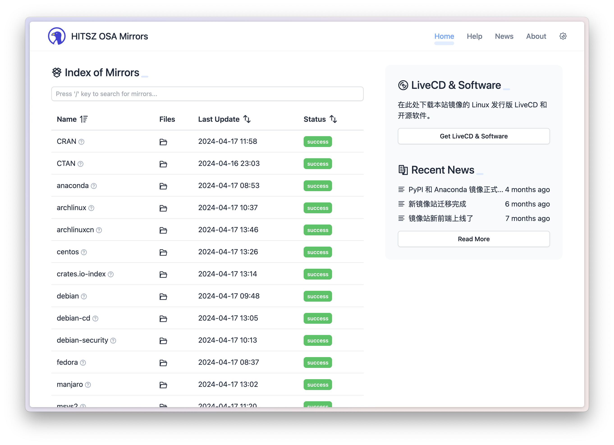

# mirrors-frontend

## Introduction

This project is the Astro frontend for HITSZ OSA Mirrors.

Current and planned features are listed here: [features-and-roadmap.md](./docs/features-and-roadmap.md).

## Usage

### Prerequisites

Make sure you have these development tools:

- [Bun](https://bun.sh/) 1.3+
- Visual Studio Code (recommended)

Then execute `bun install`.

Now you are ready to go!

### Develop

Use `bun run dev` to start the Astro dev server with hot module replacement.

Use `bun run check` for Astro type/content validation.

Use `bun run format` to apply the repository ESLint rules before every commit.

If you need local mock runtime JSON for frontend work, use:

- `bun run fixtures:sync` to copy fixture data into `public/`
- `bun run fixtures:clean` to remove those local fixture copies again

### Build and Deploy

Production builds are static Astro output under `dist/`.

Typical local verification flow:

1. Run `bun install`
2. Run `bun run check`
3. Run `bun run build`
4. Deploy the contents of `dist/`

If you want to preview the built site locally, run `bun run preview` after `bun run build`.

## Where to start

Here are some resources that might help you learn how to develop this project:

- Vue 3 Guide: <https://vuejs.org/guide/introduction.html>
- Vue 3 Composition API Reference: <https://vuejs.org/api>
- Astro Docs: <https://docs.astro.build>
- Astro Content Collections Docs: <https://docs.astro.build/en/guides/content-collections/>
- Tailwind CSS Docs: <https://tailwindcss.com/docs/installation>
- Pinia Guide: <https://pinia.vuejs.org/core-concepts>

We use IconPark Outline as the primary icon library. You can find the icons at:

- Icônes: <https://icones.js.org/collection/icon-park-outline>

## Coding conventions

Please refer to [coding-conventions.md](./docs/coding-conventions.md).
